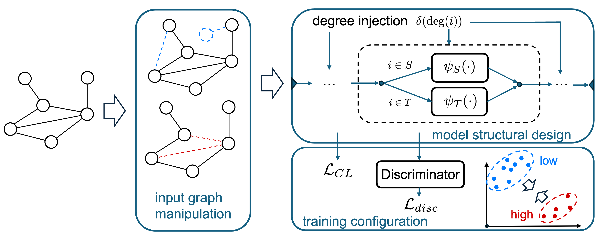

# Design Space for Degree Fair GNN

This is the repository for [Design Space for Degree Fair GNN](https://openreview.net/forum?id=DCiSjpcQAZ&referrer=%5Bthe%20profile%20of%20Taiki%20Ishisaki%5D(%2Fprofile%3Fid%3D~Taiki_Ishisaki1)).



## Setup

After installing [PyTorch 2.0.1](https://pytorch.org/get-started/previous-versions/), please execute the following command:

```
$ pip install -r requirement.txt
```

## Train & Test
The following command is the minimum setup required to run the training with GCN on the EMNLP dataset:

```
$ python main.py --base 1 --dataset "emnlp" --gpu "0" --dir_name hogehoge
```

Base 1, 2, and 3 correspond to GCN, GAT, and GraphSAGE, respectively. 

To run the experiment, a folder named after the dataset will be created under the experiment directory, and the execution results will be stored in the directory specified by dir_name.

To specify the functions defined in the paper, please execute main.py with the following arguments for each base model:

- Input Graph Manipulation
    - Edge Adding for Low-degree -> "--edge_adding_4_low"
    - Edge Removing -> "--edge_removing"
    - Node Adding for Low-degree -> "--node_adding_4_low"
- Model Structural Design
    - Structural Contrast -> "--structural_contrast_on_degfair"
    - Degree Injection -> "--degree_injection"
    - Low Degree Finetune -> "--low_degree_finetune"
    - Low Degree Additional Layer -> "--low_degree_additional_layer"
    - Missing Information -> "--missing_info"
- Training Configuration
    - Pair-wise Degree Contrastive -> "--pairwise_degree_cl"
    - Mean Contrastive -> "--mean_cl"
    - Degree Discriminator -> "--degree_disc"
    - Augmented Low-degree Discriminator -> "--augmented_low_degree_disc"

Additionally, to run hyperparameter tuning, set the argument --optuna and specify the number of trials as needed. Here are the commands with the --optuna argument:

```
$ python main.py --model "DegreeFairGNN" --base 1 --dataset "emnlp" --gpu "0" --dir_name hogehoge --optuna --optuna_n_trials 100
```

## LICENSE
CC BY 4.0